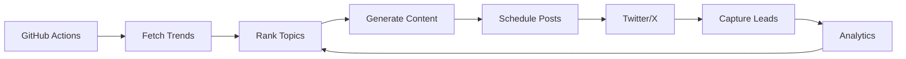

# AI Solopreneur Bot 🤖

An autonomous AI-powered system that discovers trending topics, generates engaging content, schedules posts, captures leads, creates digital products, and continuously optimizes—all using **free-tier services**.

## 🎯 What It Does

This bot automates your entire solopreneur content pipeline:

1. **Discovers Trends** - Finds trending topics on Twitter/X (AI, solopreneurship, productivity)
2. **Ranks Topics** - Scores topics by engagement potential and past performance
3. **Generates Content** - Creates tweets, threads, and CTAs using AI
4. **Auto-Posts** - Schedules and publishes content at optimal times
5. **Captures Leads** - Collects interested followers via DMs and landing pages
6. **Creates Products** - Generates digital products (PDFs, guides) and publishes to Gumroad
7. **Analyzes Performance** - Tracks metrics and feeds insights back into the system

## 🏗️ Architecture

```
ai-solopreneur-bot/
├── src/
│   ├── trend_fetcher/       # Discovers trending topics on Twitter/X
│   ├── niche_selector/      # Ranks and selects best topics
│   ├── content_generator/   # Generates tweets and threads using LLMs
│   ├── scheduler_poster/    # Auto-posts content at optimal times
│   ├── lead_capture/        # Captures leads from engagement
│   ├── product_generator/   # Creates digital products (PDFs, guides)
│   └── analytics_engine/    # Tracks performance and optimizes
├── config/                  # Configuration files
├── data/                    # SQLite database and cached data
├── scripts/                 # Utility scripts (DB init, etc.)
├── .github/workflows/       # GitHub Actions for automation
└── requirements.txt         # Python dependencies
```

## 🚀 Quick Start

### Prerequisites
- Python 3.11+
- Git
- Twitter/X API credentials (free tier)
- OpenAI API key (optional) or Ollama (local, free)
- Gumroad account (free)

### Installation

1. **Clone the repository**
   ```bash
   git clone https://github.com/yourusername/ai-solopreneur-bot.git
   cd ai-solopreneur-bot
   ```

2. **Install dependencies**
   ```bash
   pip install -r requirements.txt
   ```

3. **Initialize the database**
   ```bash
   python scripts/init_db.py
   ```

4. **Configure environment variables**
   
   Create a `.env` file in the root directory:
   ```env
   # Twitter API (Free Tier)
   TWITTER_API_KEY=your_api_key
   TWITTER_API_SECRET=your_api_secret
   TWITTER_ACCESS_TOKEN=your_access_token
   TWITTER_ACCESS_SECRET=your_access_secret
   TWITTER_BEARER_TOKEN=your_bearer_token
   
   # OpenAI (Optional - or use Ollama locally)
   OPENAI_API_KEY=your_openai_key
   
   # Gumroad
   GUMROAD_ACCESS_TOKEN=your_gumroad_token
   ```

5. **Run locally (test)**
   ```bash
   # Fetch trends
   python src/trend_fetcher/main.py
   
   # Generate content
   python src/content_generator/main.py
   
   # Post content
   python src/scheduler_poster/main.py
   ```

6. **Deploy to GitHub Actions**
   
   - Push to GitHub
   - Add secrets in Settings → Secrets and variables → Actions
   - Enable GitHub Actions workflows

## 📦 Modules

### 1. Trend Fetcher
- **Purpose**: Discover trending topics on Twitter/X
- **API**: Twitter API v2 (500K tweets/month free)
- **Output**: Trending topics with engagement metrics

### 2. Niche Selector
- **Purpose**: Rank topics by relevance and performance
- **Tools**: scikit-learn, Ollama/OpenAI
- **Output**: Top 5 topics to create content about

### 3. Content Generator
- **Purpose**: Generate tweets, threads, and CTAs
- **Tools**: Ollama (Llama 3.2) or OpenAI GPT-3.5/4
- **Output**: 10-15 tweets per topic

### 4. Scheduler/Poster
- **Purpose**: Auto-post content at optimal times
- **Tools**: Twitter API, GitHub Actions
- **Schedule**: 3x daily (9 AM, 2 PM, 6 PM)

### 5. Lead Capture
- **Purpose**: Capture interested leads
- **Tools**: GitHub Pages, Formspree, Twitter API
- **Output**: Lead database with contact info

### 6. Product Generator
- **Purpose**: Create digital products and publish to Gumroad
- **Tools**: WeasyPrint, Gumroad API
- **Output**: PDFs, guides, prompt packs

### 7. Analytics Engine
- **Purpose**: Track performance and optimize
- **Tools**: Twitter API, Plotly, pandas
- **Output**: Performance dashboard and insights

## 🔄 Automation Flow



**Daily Schedule:**
- **9:00 AM** - Fetch trending topics
- **10:00 AM** - Rank topics and generate content
- **2:00 PM** - Post content (1st tweet)
- **6:00 PM** - Post content (2nd tweet)
- **11:00 PM** - Analyze performance and update weights

**Weekly:**
- **Sunday 10 AM** - Generate new digital product and upload to Gumroad

## 💰 Cost Breakdown

| Service | Free Tier | Usage | Cost |
|---------|-----------|-------|------|
| GitHub Actions | 2,000 min/month | ~45 min | $0 |
| Twitter API | 500K tweets/month | ~10K | $0 |
| Ollama (Local LLM) | Unlimited | Unlimited | $0 |
| Gumroad | Unlimited | 10% per sale | $0* |
| GitHub Pages | Unlimited | Static hosting | $0 |
| SQLite | Unlimited | Local DB | $0 |

**Total: $0/month** 🎉

\* Gumroad charges 10% only on successful sales

## 🛠️ Technology Stack

- **Language**: Python 3.11+
- **Database**: SQLite
- **LLM**: Ollama (Llama 3.2) or OpenAI
- **Scheduling**: GitHub Actions
- **APIs**: Twitter API v2, Gumroad API
- **PDF Generation**: WeasyPrint / ReportLab
- **Data Analysis**: pandas, plotly
- **Web Scraping**: BeautifulSoup4

## 📊 Expected Results

After 30 days of automation:
- ✅ **90+ tweets** posted automatically
- ✅ **40+ leads** captured
- ✅ **4+ digital products** created and published
- ✅ **Engagement rate** > 2%
- ✅ **Time saved**: 15+ hours/week

## 🔐 Security

- All API keys stored as GitHub Secrets
- `.env` file excluded from git (`.gitignore`)
- No sensitive data committed to repository
- Rate limiting to avoid API abuse

## 📈 Roadmap

- [x] Project setup and architecture
- [ ] Trend fetcher implementation
- [ ] Niche selector with ML scoring
- [ ] Content generator with LLM
- [ ] GitHub Actions scheduler
- [ ] Lead capture system
- [ ] Product generator + Gumroad integration
- [ ] Analytics dashboard
- [ ] Multi-platform support (LinkedIn, Instagram)
- [ ] Email automation
- [ ] A/B testing for content

## 🤝 Contributing

Contributions are welcome! Please:
1. Fork the repository
2. Create a feature branch (`git checkout -b feature/amazing-feature`)
3. Commit your changes (`git commit -m 'Add amazing feature'`)
4. Push to the branch (`git push origin feature/amazing-feature`)
5. Open a Pull Request

## 📄 License

MIT License - feel free to use this for your own solopreneur journey!

## 🙏 Acknowledgments

- Built with [Ollama](https://ollama.ai/) for local LLM inference
- Powered by [Twitter API v2](https://developer.twitter.com/en/docs/twitter-api)
- Products hosted on [Gumroad](https://gumroad.com/)
- Automated with [GitHub Actions](https://github.com/features/actions)

---

**Made with ❤️ by AI agents in Google Antigravity**

*Start your autonomous solopreneur journey today!* 🚀
